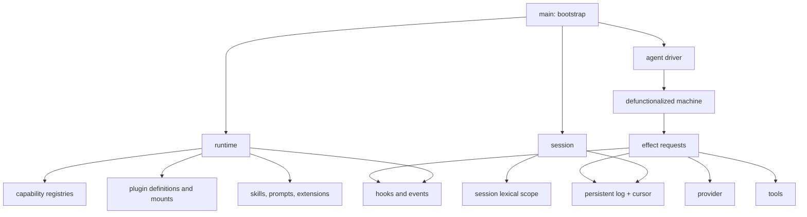

# sah 核心机制设计

> 状态：当前实现的规范性设计文档
> 日期：2026-09-14
> 配套文档：[系统开发](DEVELOPMENT.md) ·
> [组合与扩展](DESIGN-COMPOSITION.md) ·
> [当前 gap](GAP-IMPLEMENTATION.md)

## 1. 一句话定义

sah 是一个用 Scheme datum 描述控制、历史、作用和组合关系，再由少量解释器执行的
agent harness。

它借用了三组思想，但没有把三套框架简单拼在一起：

- 从 pi agent 取最小 harness：模型、工具、会话、资源和界面分层；
- 从 Cordis 取 effect ownership：每个动态作用都必须知道由谁安装、如何撤销；
- 从 defunctionalized CPS 取显式控制：下一步工作和 continuation 是数据，不藏在
  宿主递归栈里；
- 从 Scheme 取同像性：消息、状态、程序、日志和扩展计划尽量使用同一种可读数据表示。

最终形成的不是“带插件的聊天循环”，而是一个小型 agent 抽象机：

```text
input
  -> machine transition
  -> effect request
  -> effect interpreter
  -> effect result
  -> continuation resume
  -> next machine state
```

会话 journal 记录已经提交的事实，machine 描述尚未完成的控制，plugin frame 记录动态
能力的撤销证据，runtime 则是这些可变资源的唯一所有者。

## 2. 五个正交对象

| 对象 | 回答的问题 | 当前表示 |
|---|---|---|
| datum | 系统正在处理什么值 | `msg`、`call`、entry、event |
| machine / kont | 下一步要做什么 | `machine`、`await`、`kont`、`effect-result` |
| effect / frame | 要改变什么，如何撤销 | agent effect、plugin op、prepared、frame |
| journal / cursor | 什么已经提交，当前在哪条历史 | `slog`、SexprL session file |
| scope / owner | 名字与动态能力属于谁 | `scope`、runtime-owned registry cell |

这五者不能互相替代：

- event 是实时观察，不是事实存储；
- transcript 是历史，不是 continuation；
- dependency graph 决定依赖，不等于 Scheme 的单父环境链；
- rollback frame 能撤销已声明的动态 effect，不能让任意外部世界倒流；
- `eval` 提供 Scheme 求值能力，但不定义 agent 控制语义。

## 3. 总体结构



源码主轴是：

```text
core/data
  -> core/scope
  -> core/runtime
  -> core/capability
  -> core/plugin
  -> session / provider / tools
  -> agent/machine
  -> agent/agent
  -> modes / main
```

`manifest.ss` 是唯一加载顺序。加载源码只定义函数和 datum；真正的安装发生在
`main` 的显式 bootstrap 中。

## 4. Runtime：唯一的可变所有者

`runtime` record 收拢一个 sah 实例的全部动态状态：

```scheme
(runtime
  config
  root-scope
  session-root-scope
  tools commands hooks input-handlers subscribers
  next-token
  plugins mounts op-handlers
  skills prompts extensions
  chat-override)
```

这里最重要的不是 record 本身，而是所有权规则：

1. 核心调用链显式传递 `rt`；
2. 两个 runtime 的工具、hook、插件、事件订阅和 provider override 完全隔离；
3. `current-runtime`、`current-session`、`current-owner` 只用于 extension/tool
   边界，避免要求扩展作者手工传递整条上下文；
4. load-time 不再修改 process-global registry；
5. reload 根据 owner 删除动态能力，不依赖“保存一份 baseline 再整体还原”。

### 4.1 两种根作用域

runtime 内有两个不同目的的根环境：

- `root-scope` 基于 `interaction-environment`，供 plugin program 求值。构建产物会把
  sah 的顶层定义装入该环境，使插件可以使用 `op-*` 构造子和扩展 DSL；
- `session-root-scope` 基于 `(environment '(chezscheme))` 的可变副本，供会话 `eval`
  使用。会话能使用 Chez Scheme，但不会自动看到 sah 的 runtime 内部绑定。

这不是安全沙箱。Chez 标准环境仍然具有文件和进程能力。它解决的是语义隔离和状态归属，
不是恶意代码隔离。

## 5. Capability：带 owner 的遮蔽栈

工具和命令不是单值哈希表，而是按注册顺序保存的 owner cell：

```scheme
(owned OWNER VALUE)
```

同名注册形成遮蔽：

```text
extension read
core read
```

查找只看到最上层定义。删除 extension owner 后，原来的 core 定义自然重新出现。这个
性质对 reload 和失败清理很关键，它避免“扩展覆盖了内置工具，扩展加载又失败，原工具也
永久消失”的状态破坏。

当前 capability 包括：

- tools；
- slash commands；
- input handlers；
- hooks；
- plugin op handlers。

核心工具以纯 datum 定义：

```scheme
(tool NAME DESCRIPTION PARAMETERS HANDLER)
```

源码加载不会注册它们。`install-core-tools!` 在 runtime 创建后统一安装。

## 6. Agent machine：显式控制而非直接递归

### 6.1 数据形状

`agent/machine.ss` 定义四种控制 datum：

```scheme
(machine PHASE SESSION CONFIG STEP PAYLOAD)
(await EFFECT KONT)
(kont TAG ...)
(effect-result ok VALUE)
(effect-result error KIND REASON)
```

`machine-transition` 只查看 machine datum，返回：

- 一个新的纯 machine state；
- 一个待解释的 `await`；
- `(done REPLY)`；
- `(failed REASON)`。

`machine-resume` 只查看 continuation 和 effect result，生成下一 machine state。
provider、工具、文件写入、hook 和事件都不在这两个函数中执行。

### 6.2 当前 phase

| phase | 意义 | 请求的 effect |
|---|---|---|
| `begin` | 准备并提交用户输入 | `begin` |
| `turn` | 检查 step 上限并开始一轮 | `auto-compact` |
| `request` | 请求模型 | `provider` |
| `force-compact` | context overflow 后强制压缩 | `force-compact` |
| `commit` | 持久化 assistant reply | `commit-reply` |
| `tools` | 顺序执行工具调用 | `execute-tool` |
| `finish` | 关闭生命周期 | `finish` |
| `done` | 终态 | 无 |

context overflow 不是散落在 provider 调用外层的异常重试。它变成：

```text
provider error(context-overflow)
  -> force-compact
  -> provider retry once
  -> success or failed
```

重试标记位于 machine payload 中，因此控制决策是可检查的。

### 6.3 Effect interpreter

`agent/agent.ss` 是 machine 的 effect interpreter。它负责：

- 执行 `before-agent-start`；
- 把 user/assistant/tool message 写入 journal；
- 调 provider；
- 执行 tool hook 和 tool handler；
- 执行 compaction；
- 发射生命周期事件；
- 把异常归一成 `effect-result`。

driver 只做一件事：反复执行
`machine-transition -> interpret effect -> machine-resume`，直到 `done` 或 `failed`。

当前 continuation 已经数据化，但还没有写入 session journal。进程崩溃后可以恢复历史，
不能恢复“当时正等待哪个 effect”。这是明确保留的下一阶段 gap，而不是隐藏能力。

## 7. Journal：历史是带游标的不可变树

会话内存结构是：

```scheme
(slog PERSISTENT-VECTOR CURSOR LINEAR?)
```

每个 entry 的 `ID` 是 vector 下标，`PARENT` 指向父 entry：

```scheme
(message ID PARENT TS MSG)
(compaction ID PARENT TS SUMMARY FIRST-KEPT TOKENS DETAILS)
(branch-summary ID PARENT TS FROM SUMMARY)
(scope-form ID PARENT TS FORM)
...
```

因此：

- append 只增加一条 entry；
- branching 只是移动 cursor；
- 原分支不会被删除；
- 当前上下文由 `root -> cursor` 路径推导；
- compaction 是树上的普通 checkpoint，不会重写旧消息。

journal 落盘格式是 SexprL，每行一个完整 datum。新 session 保持 append port；从磁盘恢复
的 session 首次写入时，通过完整 sibling staging file 和可恢复替换完成迁移，避免先删
旧文件再写新文件。

## 8. Session scope：环境是当前路径的投影

每个 session 有独立的 lexical scope。`eval` 的 durable form：

```scheme
define
define-syntax
set!
```

会以 `(scope-form ...)` 写入 journal，但不会进入发送给模型的消息上下文。

### 8.1 分支语义

scope 不是对整个文件顺序重放，而是只重放当前 cursor 路径上的 `scope-form`：

```text
root:   (define x 1)
old:    (define abandoned 2)
branch: (set! x 7)
```

切到 root 后创建 branch，新的 scope 中有 `x = 7`，没有 `abandoned`。重新加载 session
时结果相同。

这条规则把 Scheme 环境和会话树真正绑定起来：

> cursor 决定对话上下文，也决定 lexical state。

### 8.2 Durable eval 事务

持久定义必须同时满足：

1. Scheme 求值成功；
2. scope-form journal append 成功。

如果写日志失败，session 会从最后一个完整 journal 路径重建 scope，删除刚才产生的
幽灵绑定。于是内存状态不会领先于持久事实。

普通非 durable 表达式只求值，不写 journal。它们的外部副作用不具备自动回滚语义。

### 8.3 作用域写规则

- 本层 `define` 可以创建或重定义本地名字；
- 本层 `set!` 只能修改本层已经定义的名字；
- import 或父层名字不可被子层 `set!`；
- 子层可以通过 `define` 显式遮蔽父层；
- 多个 plugin import 导出同名 binding 时，链接失败，不静默选一个。

## 9. Plugin：依赖图、词法 facade 与 effect transaction

### 9.1 Plugin program

插件源码形状类似 Scheme library：

```scheme
(plugin NAME
  (imports DEP ...)
  (exports NAME ...)
  OP-FORM ...)
```

插件体不是任意 load-time effect，而是一组求值后产生 op datum 的表达式：

```scheme
(op-define 'project-name "sah")
(op-register-tool 'project-name "..." (schema '()) handler)
(op-register-hook 'before-agent-start hook)
(op-register-command 'status "..." handler)
```

### 9.2 Graph 与 scope chain 分离

依赖关系是图，Chez 环境只有单 parent。sah 不把二者混为一谈：

1. 递归解析 dependency graph；
2. 确认无缺失依赖和 cycle；
3. 读取每个 dependency 的 declared exports；
4. 把 export 值投影到独立 import facade；
5. 将多个 facade 合成为插件的 parent chain；
6. 在其上创建 plugin local scope。

private binding 不会穿过 facade。冲突判断只针对 declared 且实际存在的 exports。

### 9.3 Op algebra

op handler 由 runtime 持有，形状为：

```scheme
(op-handler OWNER KIND UNDO-KIND
            REQUIRES PREPARE APPLY ROLLBACK SHOW)
```

职责：

- `REQUIRES` 声明 op 需要的 binding；
- `PREPARE` 在任何外部 effect 发生前读取 rollback 所需状态；
- `APPLY` 执行 effect，返回 handle；
- `ROLLBACK` 使用 prepared state 和 handle 撤销；
- `SHOW` 可选，只负责可读呈现。

执行后形成 frame：

```scheme
(frame OWNER OP SOURCE PREPARED HANDLE UNDO-KIND STATUS)
```

frame 是撤销证据，不是不透明 disposer 闭包。

### 9.4 两阶段 mount

一次 `runtime-mount-plugin!` 覆盖本次新激活的完整 dependency subgraph：

```text
resolve/link all scopes
  -> build complete op plan
  -> prepare every effect op
  -> mark mounts committing
  -> apply in dependency order
  -> record frames
  -> mark all mounted
  -> publish buffered events
```

prepare 阶段失败时，apply 次数必须为 0。

commit 阶段失败时，已经 apply 的 frame 按严格逆序 rollback。rollback 全部成功后恢复
mount snapshot；rollback 自身失败时，不能伪装成成功，而是保留：

```scheme
(mount NAME transaction-failed SCOPE OPS RESIDUAL-FRAMES)
```

之后 `runtime-dispose-plugin!` 可以继续处理 residual frame。

### 9.5 Dispose

dispose 先卸载依赖当前 plugin 的 mounted plugin，再逆序撤销自己的 registry frame。
scope effect 的逆是丢弃整个 plugin scope，因为 Chez 没有可靠的单 binding 删除操作。

失败状态为：

```text
dispose-failed
```

未撤销的 frame 原样保留，可再次调用 dispose。只有 frame 真正撤销后才发
`plugin-undo` 事件。

### 9.6 Mount 状态

```text
defined
  -> linking
  -> linked
  -> committing
  -> mounted
  -> disposing
  -> defined

commit rollback failure -> transaction-failed
dispose failure         -> dispose-failed
```

`transaction-failed` 和 `dispose-failed` 都是诚实状态，不是日志警告。

## 10. Hooks 与 events

events 和 hooks 使用同一个 runtime，但语义完全不同。

### Events

- 只观察；
- subscriber 异常被记录但不改变核心流程；
- plugin mount 事件只在整个事务提交后发布；
- session journal 才是持久事实源。

### Hooks

- 可以 transform、veto 或产生 effect；
- 每个 stage 有集中定义的 failure policy；
- guard/veto 类 hook 默认 fail-closed；
- observer/transform 类 hook 默认 fail-open；
- hook failure 会发 `(ev hook-failed ...)`。

当前 stage 与策略定义集中在 `core/runtime.ss` 的 `hook-specs`，调用点不能自行发明失败
语义。

## 11. Provider 与 context

provider adapter 只负责协议形状：

- OpenAI-compatible Chat Completions；
- OpenAI Responses；
- streaming delta 转换为 runtime event；
- request/response codec；
- usage 与 provider continuation data。

agent context 由：

```text
system prompt
  + current journal path projected to messages
  + latest compaction checkpoint
```

动态工具列表来自 runtime。生成式默认 system prompt 会在 extension tools 加载后重新
计算，因此 prompt 里列出的工具与实际可调用工具一致。

OpenAI Responses 的 opaque output 当前保存在 usage alist 的 `responses-output` 中以供
下一次请求重放。这保持了协议正确性，但概念上仍应从 token usage 中拆出，见 gap 文档。

## 12. Bootstrap

`main` 的顺序是确定的：

```text
parse args
  -> load raw config
  -> runtime-new
  -> install core op handlers
  -> install core tools
  -> install resource input handlers
  -> finalize base config
  -> load extensions / mount plugins
  -> load skills and prompts
  -> refresh generated system prompt
  -> resolve or create session
  -> subscribe renderer
  -> session-start hooks
  -> register session commands
  -> run REPL or print driver
  -> session-end hooks
  -> close journal
```

这个顺序也是生命周期契约。源码文件的加载顺序不再承担 runtime 初始化。

## 13. 核心不变量

1. 一个运行实例的动态状态只属于一个 runtime。
2. 核心路径显式传递 runtime；dynamic parameter 只用于边界。
3. machine transition 和 continuation resume 不执行 IO。
4. 只有 effect interpreter 执行 provider、tool、hook 和 journal effect。
5. journal 只追加完整 datum；内存状态不能领先于 durable journal。
6. cursor 同时决定 conversation context 和 session lexical scope。
7. scope-form 不进入模型上下文。
8. import 只暴露 declared exports，private binding 不泄漏。
9. 子 scope 不能 `set!` 父 scope binding。
10. plugin dependency subgraph 在任何 apply 前完成 prepare。
11. commit 事件只在整个 plugin transaction 成功后发布。
12. rollback/dispose 失败必须保留 residual frame 和失败状态。
13. owner 删除后，被遮蔽的旧 capability 必须重新可见。
14. extension 加载失败不能留下 tool、command、hook、plugin 或 op handler。
15. 两个 runtime 不能共享可变 registry。
16. source、test、build 使用同一个 manifest。

## 14. 这种设计为什么适合 Scheme

这里的 Scheme 优雅不在于“少写几行”，而在于几个层次使用同一种材料：

- 对话是 datum；
- machine state 是 datum；
- continuation 是 datum；
- plugin program 是 datum；
- op 和 frame 是 datum；
- journal 是 datum stream；
- config 是 alist；
- 协议边界才转换为 JSON。

因此检查、测试、打印、持久化和解释不需要五套对象模型。复杂度集中在少数解释器和
不变量上，而不是分散在类层级、回调生命周期和隐藏 singleton 中。

真正应当保持的“极简”不是文件数量少，而是语义中心少：

```text
machine explains control
journal explains history
scope explains names
op/frame explains owned effects
runtime explains mutable ownership
```

其余模块都应当是这些中心的具体解释器或边界适配器。
